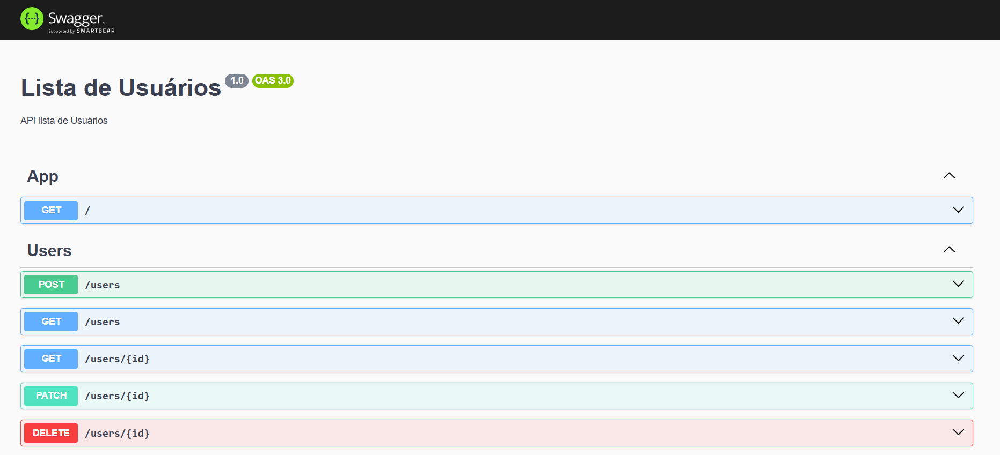

#### Screens API Nest + Doc Swagger



#### 1:: Criando API Nest

* 1:: Script de criação
```
npx nest new api-name
```

* 2:: Entrando na pasta do projeto
```
cd api-name
```

* 3:: Rodando 1. Vez
```
npm run start:dev
```

#### 2:: Prisma Install
* 1
```
npm install prisma --save-dev
```

* 2
``` 
npm install @prisma/client
```

* 3
```
npx prisma init
```

* 4 Conexão inicial .env com sqlite
```
DATABASE_URL="file:./banco.db"
```

* 5 schema.prisma config provider banco sqlite
```
datasource db {
  provider = "sqlite"
  url      = env("DATABASE_URL")
}
```

#### 3:: Prisma Entity e migrate

* 1 Entity User
```
model User{
  id    Int  @id @default(autoincrement())
  name String @unique
  email String @unique
  password String
  
  created DateTime @default(now())
  updated DateTime @updatedAt()
}
```

* 2 Prisma Migrate
```
npx prisma migrate dev
```

#### 4:: Gerando Modulo de conexao conexao
* Prisma module
```
npx nest g module prisma --no-spec
```

* Prisma module Modelo
```
import { Module } from '@nestjs/common';
import { PrismaService } from './prisma.service';

@Module({
  providers: [PrismaService],
  exports: [PrismaService]
})

export class PrismaModule {}

```

* Prisma Service
```
npx nest g service prisma --no-spec
```

* Prisma service Modelo
```
import { Injectable, OnModuleDestroy, OnModuleInit } from '@nestjs/common';
import { PrismaClient } from '@prisma/client';

@Injectable()
export class PrismaService extends PrismaClient implements OnModuleInit, OnModuleDestroy {
   async onModuleInit() { await this.$connect() }
   async onModuleDestroy () { await this.$connect() }
}
```

#### 5:: Criando Generate a new CRUD resource Users
* npx nest g res users

#### 6:: Configurando user conexao
* user.module.ts

#### 7:: Configurando DTOs users
* instalando modulos para validar os DTOs
```
npm install class-transformer@0.5
```

```
npm install class-validator@0.14
```

* create-user.dto.ts
```
import { IsEmail, IsNotEmpty, IsNumber, IsString, MinLength } from "class-validator";

export class CreateUserDto {
    @IsString()
    @IsNotEmpty()
    @MinLength(6)
    name: string;

    @IsEmail()
    
    @MinLength(4)
    @IsNotEmpty()
    email: string;

    @IsString()
    @MinLength(6)
    @IsNotEmpty()
    password: string;
}
```

* update-user.dto.ts
```
import { PartialType } from '@nestjs/mapped-types';
import { CreateUserDto } from './create-user.dto';

export class UpdateUserDto extends PartialType(CreateUserDto) {}
```

#### 8:: Implementando Service users
```
import { HttpException, HttpStatus, Injectable } from '@nestjs/common';
import { CreateUserDto } from './dto/create-user.dto';
import { UpdateUserDto } from './dto/update-user.dto';
import { PrismaService } from 'src/prisma/prisma.service';

@Injectable()
export class UsersService {
  constructor(private prisma: PrismaService){}

  async create(createUserDto: CreateUserDto) {
    try{
      const user = await this.prisma.user.create({
        data: {
          name: createUserDto.name,
          email: createUserDto.email,
          password: createUserDto.password
        },
        select:{ id:true, name: true, email: true }
      })
      return user;
    }catch(error){
      console.log(error)
      throw new HttpException('Usuário não encontrado', HttpStatus.NOT_FOUND)
    }
  }

  async findAll() {
    const user = await this.prisma.user.findMany()

    if(user) return user;

    throw new HttpException('Não tem registros', HttpStatus.NOT_FOUND)
  }

  async findOne(id: number) {
    const user = await this.prisma.user.findFirst({
      where: { id: id },
      select: { id: true, email: true }
    })

    if(user) return user;

    throw new HttpException('Usuário não encontrado', HttpStatus.NOT_FOUND)
  }

  async update(id: number, updateUserDto: UpdateUserDto) {
    try{
      // verifica se existe o id do usuário
      const user = await this.prisma.user.findFirst({
        where: { id: id },
      })

      // se não existir retorna o erro
      if(!user) { 
        throw new HttpException('Usuário não encontrado', HttpStatus.NOT_FOUND) 
      }
      // caso exista então atualiza
      const updateUser = await this.prisma.user.update({
        where: { id: user.id },
        data: { 
          name: updateUserDto.name ? updateUserDto.name : user.name, 
          email: updateUserDto.email ? updateUserDto.email : user.email, 
          password: updateUserDto.password ? user.password : user.password
      },
      // retorna os dados
      select: { id: true, name: true, email: true }
    })

    return updateUser;
    
    } catch(error) {
      console.log(error)
      throw new HttpException('Usuário não encontrado', HttpStatus.NOT_FOUND)
    }
  }

  async delete(id: number) {
    try{
      const user = await this.prisma.user.findFirst({
        where: { id: id }
      })

      if(!user){ throw new HttpException('Usuário não encontrado', HttpStatus.NOT_FOUND) }
    
      await this.prisma.user.delete({
        where: { id: user.id}
      })
    }catch(error){
      console.log(error)
      throw new HttpException('Usuário não encontrado', HttpStatus.NOT_FOUND)
    }
  }
}
```

#### 9:: Testando api

##### Listando todos
GET http://localhost:8080/users

##### Listando um
GET http://localhost:8080/users/3

##### Apagando 
DELETE http://localhost:8080/users/2

##### Inserindo
POST http://localhost:8080/users
Content-Type: application/json

{
    "name": "Xiaomi X-3 pro",
    "email": "admin@gmail.com",
    "password": "123123"
}

##### Atualizando
PATCH http://localhost:8080/users/1
Content-Type: application/json

{
    "name": "Xiaomi X-3 pro 2 atualizado",
    "email": "admin2_atualizado@gmail.com",
    "password": "123123"
}

#### 10:: Documentando api com Swagger

```
npm install --save @nestjs/swagger
```

```
npm install swagger-ui-express
```

* config no main.ts
```
  import { NestFactory } from '@nestjs/core';
import { AppModule } from './app.module';
import { DocumentBuilder, SwaggerModule } from '@nestjs/swagger';
import { ValidationPipe } from '@nestjs/common';

async function bootstrap() {
  const app = await NestFactory.create(AppModule);

  app.enableCors({
    origin: '*',
  })

  const configSwagger = new DocumentBuilder()
    .setDescription('API lista de Usuários')
    .setBasePath('localhost:8080')
    .setTitle('Lista de Usuários')
    .setVersion('1.0')
    .build();

  const documentFactory = () => SwaggerModule.createDocument(app, configSwagger)
  SwaggerModule.setup('docs', app, documentFactory)

  app.useGlobalPipes(new ValidationPipe(
    {whitelist: true, } // remove todos valores que passados a mais
  ))

  await app.listen(process.env.PORT ?? 3000);
}
bootstrap();
```

  * nest-cli.json
  ```
  "compilerOptions": {
    "deleteOutDir": true,
    "plugins": [
      "@nestjs/swagger/plugin"
    ]
  }
  ```